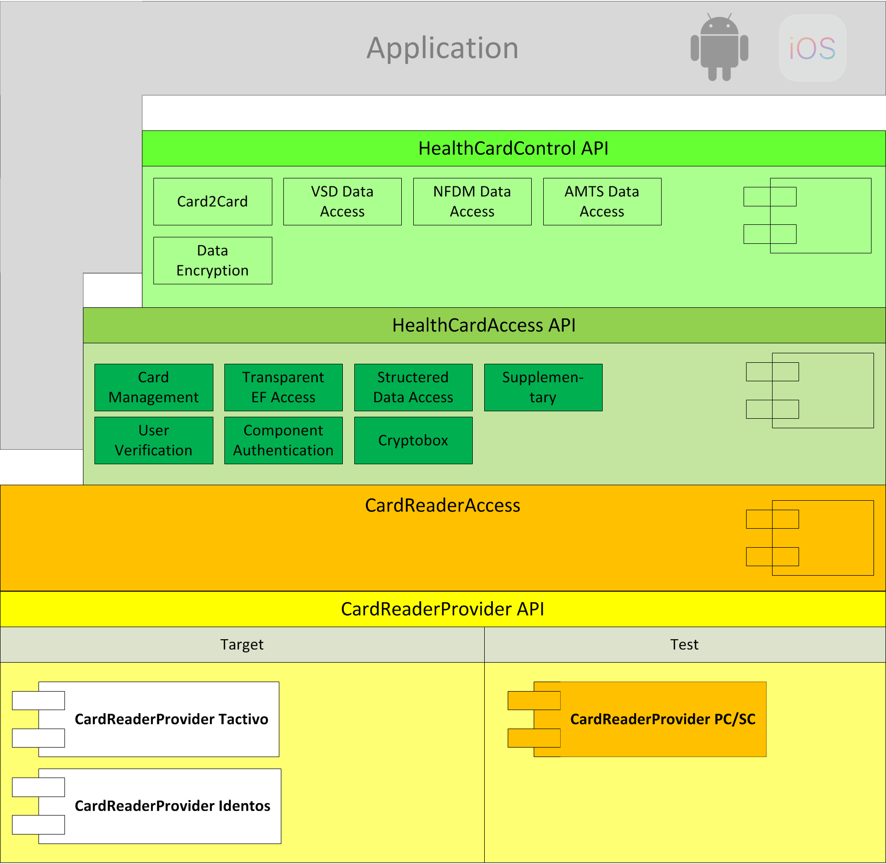
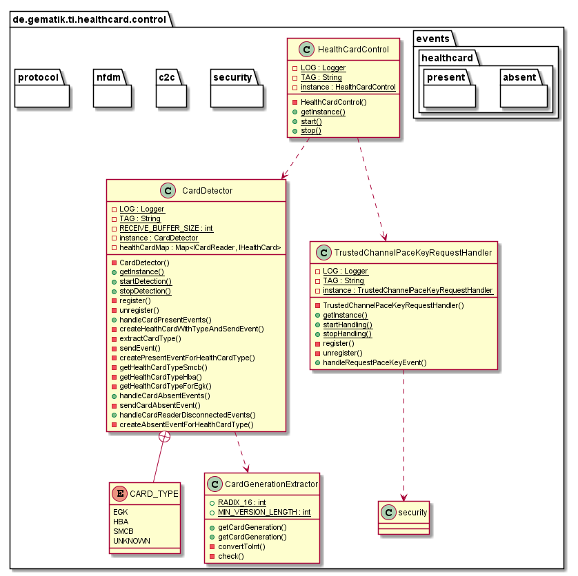
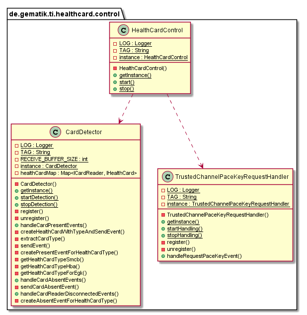
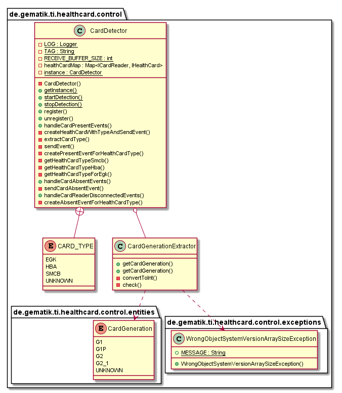
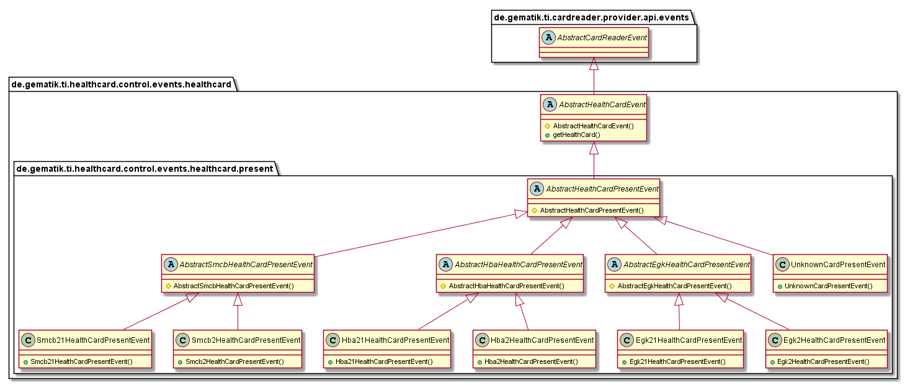
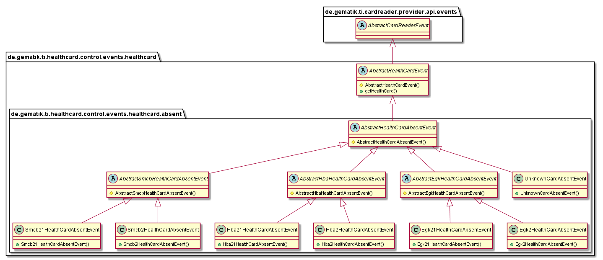
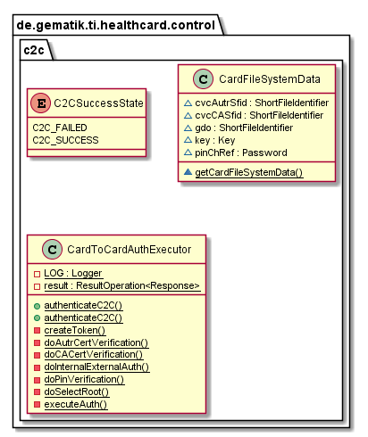
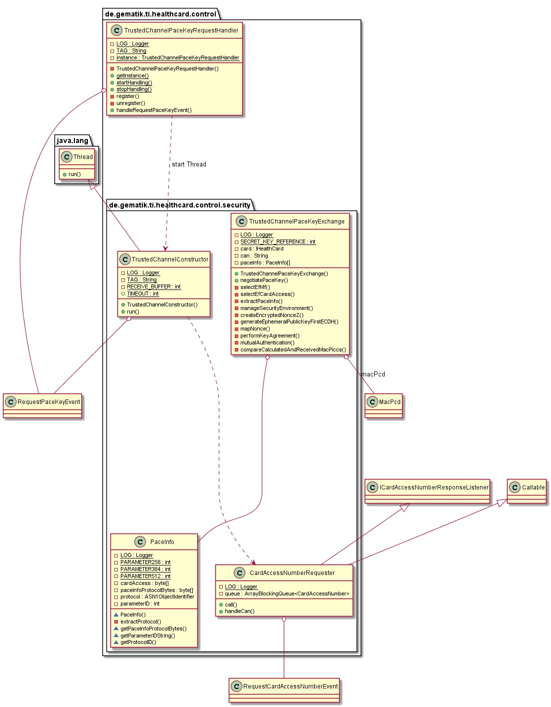
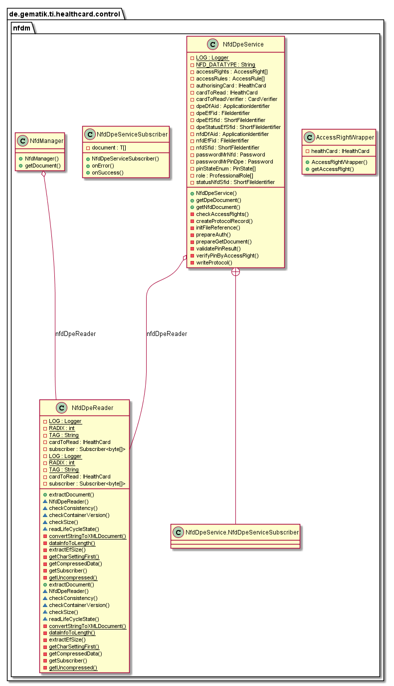

# HealthCardControl

This part describes the usage of HealthCardControl.

## API Documentation

Generated API docs are available at <https://gematik.github.io/ref-HealthCardControl>.

## License

Licensed under the [Apache License, Version 2.0](https://www.apache.org/licenses/LICENSE-2.0).

## Overview

This library contains the `CardDetector` to determine automatically the current present card type and generation and inform about card events.
The `CardToCardAuthExtractor` runs a process of C2C authentification without negociation of Sessionkey.

The Events send over EventBus are stored in package `de.gematik.ti.healthcard.control.events` and subpackages.

For each PaceKeyRequest event starts the `TrustedChannelPaceKeyRequestHandler` a thread in this instance in order to request the CardAccessNumber via an event bus request from the user interface or another application.
After the CardAccessNumber response, the PaceKey negotiation is started, and after the successful negotiation, the requester is informed of the Pacekey.

In addition, functionalities for reading the emergency data (NFD) as well as data for the personal declaration of the insured (DPE) are provided.
Access to the card, such as reading emergency data, is logged by ProtocolWriter class.

  

## HealthCardControl

This is the singleton object to start all handler and services for the control layer from one point

  

## CardDetector

### Purpose

The singleton Card Detector subscribe to EventBus for Card- and CardReader-Events.
For each CardPresent-Event determine this class automatically the Card Type (e.g. EGK, HBA or SMCB) and the Card Generation (e.g. G2, G2.1).
With this information would the `HealtCard` object initialized and the EventBus subscriber informed with HealthCardPresentEvents for the specific type.
Furthermore the CardDetector send an event for each absent card or disconnected card reader with containing health card.

  

### HealthCardPresentEvents

The control layer send specific events for each present health card or if the type is unknown an UnknownCardPresentEvent.
The subscriber could subscribe for specific HealthCardPresentEvent e.g. Egk21HealthCardPresentEvent or for generally events like AbstractEgkHealthCardPresentEvent for all EGK present events.

  

### HealthCardAbsentEvents

The control layer send specific events for each absent health card or for disconnected card reader with containing health card.
The subscriber could subscribe for specific HealthCardAbsentEvent e.g. Egk21HealthCardAbsentEvent or for generally events like AbstractEgkHealthCardAbsentEvent for all EGK absent events.

  

## Card to Card Authentication

The CardToCardAuthExecutor starts a process of mutal authentication.
The Pin of HBA should be verified before C2C.

  

## TrustedChannelPaceKeyRequestHandler

The singleton TrustedChannelPaceKeyRequestHandler subscribe to EventBus for PaceKey-Request-Events.
For each PaceKeyRequest-Event start this instance a thread to request the CardAccessNumber over Event-Bus request from UI or other application.
After CardAccessNumber response starts the PaceKey negotiation and after success negotiation would the requester informed about the pacekey.

  

## Reading NFD/DPE

The NfdDpeReader provides Methods for reading emergency data and data for the personal declaration of the insured after successful C2C authentication and PIN Verification.
The parameter emergencyIndicator to be passed regulate access in addition to C2C authentication, updateIndicator whether the document should be updated (true) or only read access should take place (false).

  

## Getting Started

### Build setup

To use CardReaderControl library in a project, you need just to include following dependency:

**Gradle dependency settings to use CardReaderControl library.**

    dependencies {
        implementation group: 'de.gematik.ti', name: 'healthcard.control', version: '1.0.0-SNAPSHOT'
    }

**Maven dependency settings to use CardReaderControl library.**

    <dependencies>
        <dependency>
            <groupId>de.gematik.ti</groupId>
            <artifactId>healthcard.control</artifactId>
            <version>1.0.3</version>
        </dependency>
    </dependencies>
